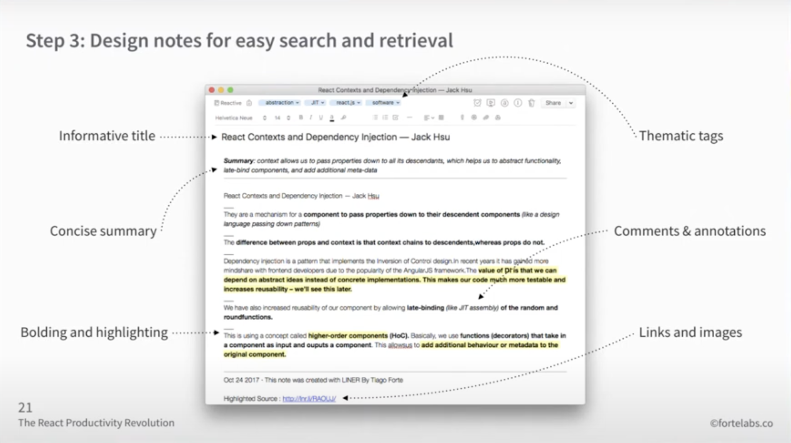
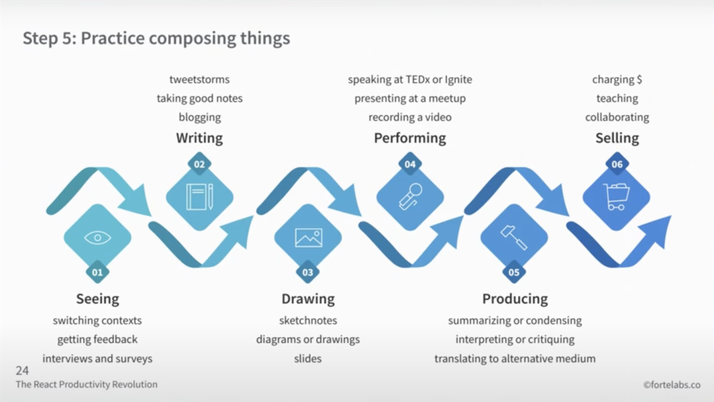

# How to work with knowledge

*Notes from the Tiago Forte's talk[^1] how to be more productive knowledge worker. He points to Flow. He explains, how to manage knowledge better with SERC approach. This enables to transform my knowledge into "Open source knowledge"[^2]*

---

## Flow
- mental state of operation in which a person performing an activity is fully immersed in a a feeling of
  - energized focus
  - full involvement
  - enjoyment
- represents intersection of positive **experience, performance and learning**
- **holy grail of productivity**

### Heavy lifts
- in order to get into flow, you don't need "Heavy lifts":
  - long uninterrupted stretches of focus time
  - avoiding interruptions, distractions (people)
  - single tasking and sprints
- sometimes "Heavy lifts" are needed, but not always, "Heavy lifts" -> are dangerous
  - they isolates you socially
  - they reduce your influence on business
  - they are hard on your body and mind

### Triggers of flow
| Internal                  | External         |
|---------------------------|------------------|
| **Clear goals**           | Presence of risk |
| **Immediate feedback**    | Deep embodiment  |
| **Challenge-skill ratio** | Rich environment |

Some factors of flow can be planed, especially internal triggers

## Improving knowledge work
Software development is also kind of knowledge work. Knowledge is from it's nature blurry, unorginezed. We can improve managing it by doing it:
- **Stateful**
- **Encapsulated**
- **Reusable**
- **Composable**

5 steps to make your work SERC (stateful, encapsulated, reusable and composable)

1. Create, identify and collect your work content
  - examples
  - illustrations
  - screenshots
  - statistics
  - mindmaps
  - diagrams
  - book notes
  - quotes
  - ...
2. Break down the content into small packets with clean edges - notes
3. Design notes for easy search and retrieval - add metadata 
4. Organize these packets by project and topic - so you can find them
5. Practice composing things 

Utilizing those 5 steps can help you to create open source knowledge[^2]

---

### Sources

[^1]: [Tiago Forte: The React Productivity Revolution](https://www.youtube.com/watch?v=BOKxSFB2hOE&t=218s)
[^2]: [Shawn Swyx Wang: The coding career handbook](https://learninpublic.org/)