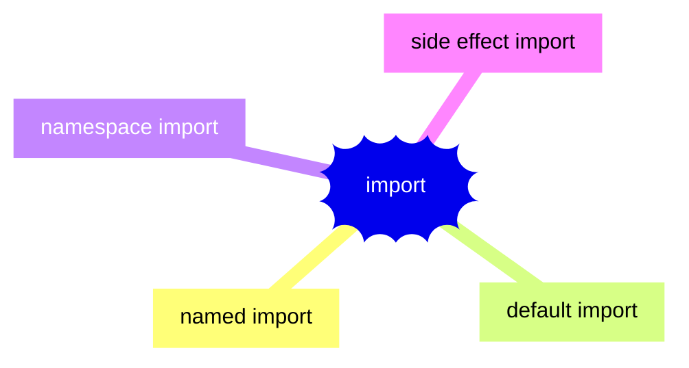
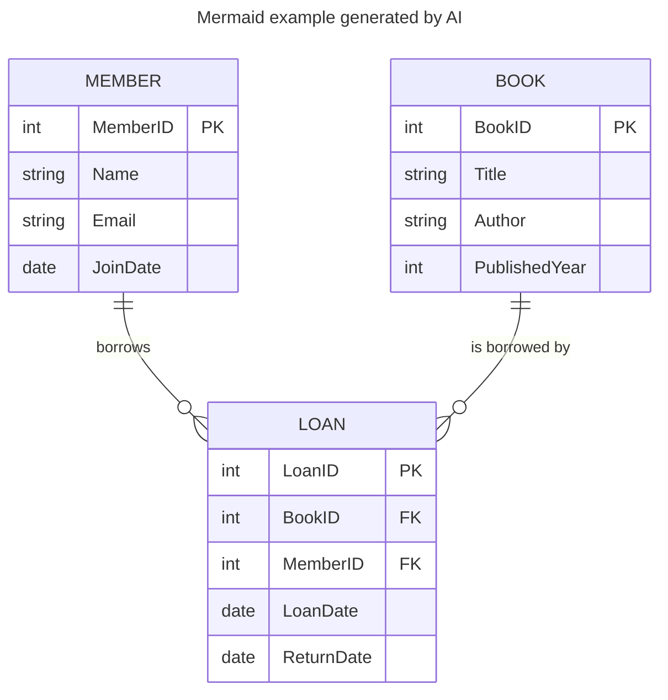

# Diagrams drawing

*Description of draw.io and mermaid*

---
**Diagramming** => placing a number of diagram elements, connect them together, add descriptive text, and style the elements to convey more complex information visually

## Draw.io

Open source project for creating diagrams and ilustrations

- [Project page](https://www.drawio.com/)
- [Online editor](https://app.diagrams.net/)

Enable to create variety of diagrams:
- flow charts
- mind maps
- org charts
- Venn diagrams
- infographics
- network and architecture diagrams
- floor plans
- electrical and rack diagrams, UML diagrams

Software development related drawings:
- [UML diagrams](https://www.drawio.com/blog/uml-2-5.html)
- [entity relationship tables for database modelling](https://www.drawio.com/blog/entity-relationship-tables.html)
- [Mermaid diagrams](https://www.drawio.com/blog/mermaid-diagrams.html)
- [Gitflow diagrams](https://www.drawio.com/blog/gitflow-diagram)

All drawn images can be exported to multiple formats and stored in git repository

Example drawn by draw.io:

  

## Mermaid diagrams
**Mermaid lets you create diagrams and visualizations using text and code.**
- they can be utilized in markdown documents
- they can be stored in git repositories
- they are rendered by gitlab/github
- there are addons for IDEs, that can display mermaid images

### Resources:
- [Mermaid live editor](https://mermaid.js.org/intro/syntax-reference.html#mermaid-live-editor)
- [Mermaid documentation](https://mermaid.js.org/)

### Examples

