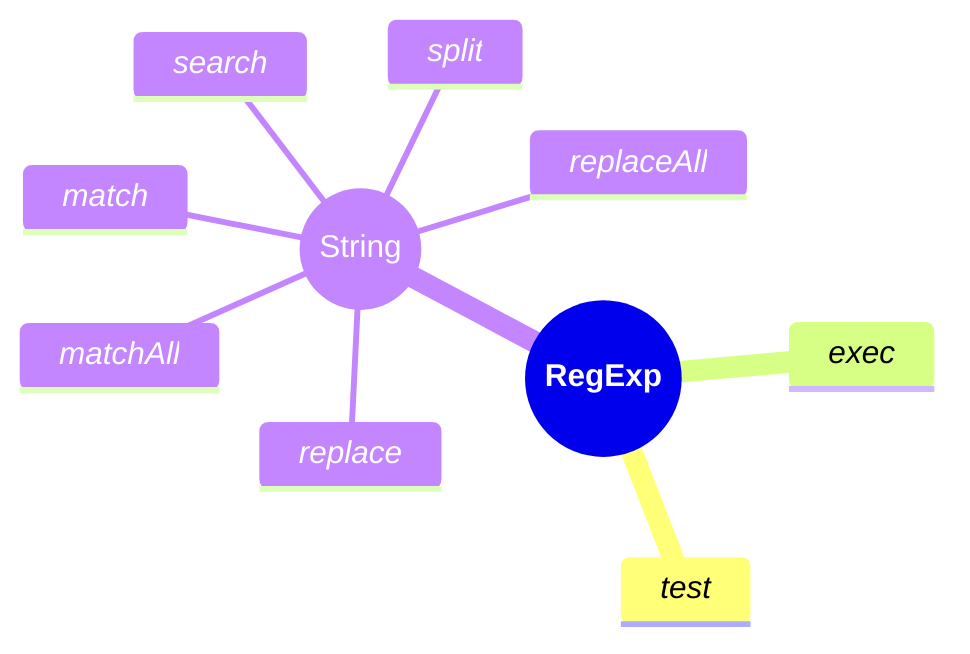

# Working with regexes

*Regex definition, basics, usage*

---
## Understand the Basics of Regular Expressions

Regular expressions(regexes) are patterns used to match character combinations in strings [^1]

A regular expression pattern is composed of: 
1. **Simple characters**
    - such as `/abc/`, it will match string `abc` in string `"Do you know abc?"` 
2. a combination of simple and **special characters**
   - such as `/ab*c/`, it will match `a` followed by 0 or more `b`s followed by `c`. It will match f.e. `abbc` in `af aabbc sa`. 
3. a combination of simple, special characters and **groups**`
   - such as `/Chapter (\d+)\.\d*/`
   - the last example includes parentheses, which are used as a memory device. The match made with this part of the pattern is remembered for later use, as described in Using groups.
   - this pattern will match `Chapter 11.345` in `We are reading Chapter 11.345`, while saving `11` as a group

Here is short cheat seat for characters and group of characters, that you can find in RegExp patterns:

- **Literals**: Characters that match themselves (e.g.: **`a`**, **`1`**).
- **Metacharacters**: Special characters with specific meanings (e.g.: **`.`**, **`*`**, **`+`**, **`?`**, **`^`**, **`$`**, **`[]`**, **`()`**, **`{}`**, **`|`**).
- **Character** Classes: Sets of characters (e.g.: **`[a-z]`**, **`\d`** for digits, **`\w`** for word characters).
- **Quantifiers**: Specify the number of occurrences (e.g.: **`*`**, **`+`**, **`?`**, **`{n}`**, **`{n,}`**, **`{n,m}`**).
- **Anchors**: Specify positions in the text (e.g.: **`^`** for start, **`$`** for end).
- **Groups** and Ranges: Use parentheses for grouping and capturing (e.g.: **`(abc)`**, **`(a|b)`**).


## JavaScript/TypeScript Regex Syntax

### How to create a regular expressions [^1]
JavaScript and TypeScript use the same regex syntax, as TypeScript is a superset of JavaScript.

Regular expression can be created using a regular expression literal, which consists of a pattern enclosed between slashes followed by flags, as follows:
```typescript
const re = /ab+c/g;
```
Using a regular expression literal, which consists of a pattern enclosed between slashes, as follows:
```typescript
const re = RegExp("ab+c", 'g');
```

### How to use regular expression
In JavaScript, regular expressions are also objects[^1] ([RegExp](https://developer.mozilla.org/en-US/docs/Web/JavaScript/Reference/Global_Objects/RegExp))

Regular expressions can be used by RegExp methods `exec` and `test`.
`String` object can use RegExps by it's methods:  `match`, `matchAll`, `replace`, `replaceAll`, `search`, and `split`.



**`RegExp.test`**: Tests for a match in a string.

```typescript
const regex = /abc/;
console.log(regex.test('abcdef')); // true
```

**`RegExp.exec`**: Executes a search for a match in a string and returns an array of results.

```typescript
const regex = /(\d+)/;
const result = regex.exec('There are 123 apples');
console.log(result[1]); // 123
```

**`String.match`**: Returns an array of matches.
```typescript
const result = 'abc123'.match(/\d+/);
console.log(result[0]); // 123
```

**`String.replace`**: Replaces matched substrings.
```typescript
const result = 'abc123'.replace(/\d+/, '456');
console.log(result); // abc456
```

**`String.search`**: Searches for a match and returns the index.
```typescript
const index = 'abc123'.search(/\d+/);
console.log(index); // 3
```

**`String.split`**: Splits a string by the regex.
```typescript
const result = 'a,b,c'.split(/,/);
console.log(result); // ['a', 'b', 'c']
```

### Online sources

- [playground](https://regexr.com/)
- [Complex cheat sheat](https://developer.mozilla.org/en-US/docs/Web/JavaScript/Guide/Regular_expressions/Cheatsheet) 
- [short cheat sheat](../assets/regex-cheatsheat.md)
- [online tutorial](https://regexone.com/)
- [online book](https://javascript.info/about) 

---
### Sources

[^1]: [Regular expressions guide on MDN](https://developer.mozilla.org/en-US/docs/Web/JavaScript/Guide/Regular_expressions)
